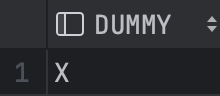
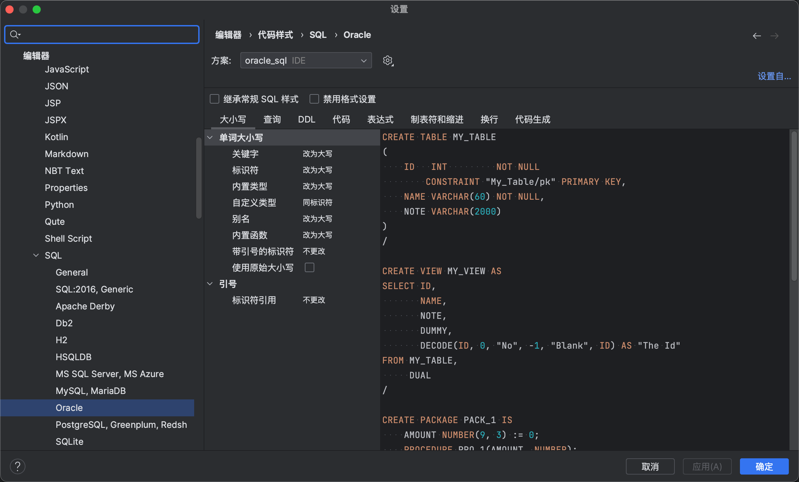
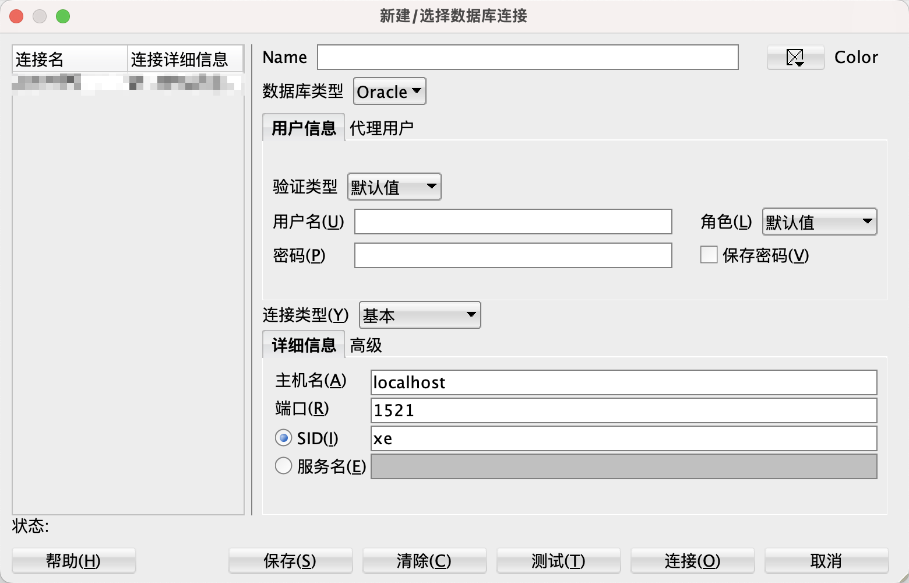

# Oracle应用开发技术

> 本次内容，主要面向开发，需要有一定的数据库基础知识。
>
> 涉及的内容：Oracle的基本概念，开发中常用的DDL、DML、DQL，以及PL/SQL

## 基本概念

### 表空间

表空间是Oracle数据库中用于组织和管理数据的逻辑存储单位。一个表空间是一些数据文件或支持空间管理功能的磁盘区域的集合。每个表空间都有一个名字，并且可能有一些可选的特性，如用户限制、数据文件大小限制、自动扩展和备份等。

表空间是Oracle中的重要概念，它决定了数据库中数据的存储方式和管理方式。表空间可包含多个数据文件，每个数据文件只属于一个表空间。当一个表、索引或其他数据库对象被创建时，它们将被分配到某个表空间中并使用表空间中的数据文件来存储数据。

### SID

SID是Oracle实例的唯一标识符，它代表着一个Oracle数据库实例。在连接到Oracle数据库时，客户端需要提供一个SID来标识要连接的Oracle实例。SID通常由三个到八个字符组成，并且是在安装Oracle实例时指定的。

### 服务名

服务名是在Oracle网络环境中定义的一个数据库或应用程序的名称。服务名通常比SID更具有描述性和可读性，并且可以很容易地被管理员进行配置和管理。服务名可以指向多个Oracle实例，实现负载均衡。

> 服务名比SID更具有灵活性、可管理性和容错性。在连接Oracle数据库时，建议使用服务名来代替SID。

### Dual Table

Oracle提供该表，这是一个属于用户模式的特殊表，所有用户都可以访问.

该表有一列，其数据类型为`VARCHAR2`，并包含一个带有值`X`的行.

```sql
SELECT * FROM DUAL;
```



通过使用该表，可以执行包含不涉及任何表的函数的查询，如下所示:

```sql
SELECT UPPER('This is a string') FROM dual;
```

除了调用内置函数外，还可以在查询子句中使用表达式:

```sql
SELECT (10 + 5)/2 FROM dual;
```

这张表是最简单的，因为它是为快速访问而设计的.

### 标识符大写

在Oracle中，标识符（例如表名、列名、变量名等）是区分大小写的。但是，Oracle在执行SQL语句时会将所有的不带引号的标识符转换为大写字母。

例如，以下两条SQL语句是等价的：

```sql
SELECT * FROM employees;
SELECT * FROM EMPLOYEES;
```

由于Oracle中默认将不带引号的标识符转换为大写字母，因此使用大写的SQL语句可以提高代码的可读性和可维护性。

但在某些情况下，需要在SQL语句中使用区分大小写的标识符。此时，可以使用引号将标识符括起来，例如：

```sql
SELECT 'FIRST_NAME' AS "firstName", 'LAST_NAME' AS "lastName" FROM DUAL;
```

此时，Oracle将不会将标识符转换为大写字母，而会保留原来的大小写形式。

需要注意的是，在Oracle中使用带引号的标识符会增加代码的复杂度和风险，因此应该仅在特定场景下使用。

> 开发工具编辑器中，建议设置Oracle格式化规则，下方以IDEA为例。



### 客户端连接方式

#### SQL Developer

> Oracle SQL Developer是一个免费的集成开发环境，简化了传统和云部署中Oracle数据库的开发和管理。
>
> SQL Developer为您的PL/SQL应用程序提供完整的端到端开发，用于运行查询和脚本的工作表，用于管理数据库的DBA控制台，报告界面，完整的数据建模解决方案，以及用于将第三方数据库移动到甲骨文的迁移平台。

下载地址：[Oracle SQL Developer Downloads](https://www.oracle.com/database/sqldeveloper/technologies/download/)



#### Java JDBC

- SID连接方式，使用以下URL格式进行连接：
  1. jdbc:oracle:thin:@host:port:SID
  2. host和port分别代表数据库服务器的地址和端口号，SID是数据库实例的唯标识符。
- service_name连接方式，使用以下URL格式进行连接：
  1. jdbc:oracle:thin:@//host:port/service_name
  2. host和port分别代表数据库服务器的地址和端口号，service_name是数据库实例的服务名。

## Oracle常用数据类型

### 数字数据类型

#### Number

> `NUMBER(p, s)`

NUMBER数据类型具有精度 **p** 和小数位数 **s**。

精度(p)是数字中的总位数，范围从 1 到 38。

小数位数(s)是数字中小数点右侧的位数，范围从 -84 到 127。

可存储数字范围：$-(10^{p-s})+10^{-s}～10^{p-s}-10^{-s}$

例如，数字 1234.56 的精度为 6，小数位数为 2。存储此数字需要 NUMBER(6,2)

|示例|说明|
|--|--|
|`NUMBER(p)`|表示精度为p、小数位数为0的整数<br/>例：`NUMBER(2)，可存储-99~99`<br/>如果存储的数字超过精度 p，Oracle 将发出错误<br/>例：`NUMBER(2)，存储100，报错ORA-01438: 值大于为此列指定的允许精度`|
|`NUMBER`|等同于`NUMBER(38)`|
|`INT`<br />`INTEGER`|别名，等同于`NUMBER(38)`|
|`NUMBER(p, s)`|表示精度为p、小数位数为s的数字<br/>例：`NUMBER(3, 2)，可存储-9.99~9.99`<br/>如果存储的数字超过小数位数 s，Oracle 将对该值进行四舍五入<br/>例：`NUMBER(3, 2)，存储1.234，实际值为1.23，存储1.236，实际值为1.24`<br />小数位数为负数，则会将小数点左侧的数值舍入。<br />例：`NUMBER(3, -1)，存储111，实际值为110`|
|`DECIMAL(p,s)`|别名，等同于`NUMBER(p,s)`|

> NUMBER数据类型，不支持无符号设置，可以通过约束限制，达到类似的结果。

```sql
CREATE TABLE mytable (
  id NUMBER(2) NOT NULL,
  CONSTRAINT chk_unsigned CHECK (id >= 0)
);
```

### 字符数据类型

#### CHAR

固定长度的字符串，可存储大小为 1 到 2000 字节。

如果存储的值的长度小于定义的长度，Oracle 会将字符串的后方填充空格到最大长度。

**如果插入的值长度大于列，Oracle 将返回错误。**

```sql
-- 以字节或字符为单位指定字符串长度。
CHAR(length BYTE)
CHAR(length CHAR) -- UTF8字符集
```

在安装 Oracle 数据库时，如果没有进行字符集设置，Oracle 将使用系统默认字符集。 

需要注意的是，在实际应用中，建议尽量使用 `UTF-8` 字符集，因为它是一种通用的字符集，可以支持几乎所有的语言和字符。同时，它也是 Oracle 公司推荐的字符集。

在 Oracle 中，可以使用以下两种方式来查看字符集：

1. 查看数据库字符集：

   ```sql
   SELECT VALUE FROM NLS_DATABASE_PARAMETERS WHERE PARAMETER='NLS_CHARACTERSET';
   ```

   这条语句将返回数据库的字符集。如果没有指定字符集，Oracle 将使用系统默认的字符集。

2. 查看会话字符集：

   ```sql
   SELECT VALUE FROM NLS_SESSION_PARAMETERS WHERE PARAMETER='NLS_CHARACTERSET';
   ```

   这条语句将返回当前会话使用的字符集。如果没有显式地指定字符集，Oracle 将使用数据库字符集作为会话字符集。

| 示例                | 说明                                                         |
| ------------------- | ------------------------------------------------------------ |
| `CHAR(length)`      | 等同于`CHAR(length BYTE)`<br />例：`CHAR(2)，‘11’可以存储，‘中’不可以存储`<br />例：`CHAR(3)，‘111’，‘中’可以存储`<br />`UTF-8`是一种1～4字节的变长编码 |
| `CHAR`              | 等同于`CHAR(1 BYTE)`                                         |
| `CHAR(length CHAR)` | 例：`CHAR(2 CHAR)，‘11’，‘中文’都可以存储`                   |

#### VARCHAR2

可变长度的字符串，可以存储范围为 1 到 4000 字节。

```sql
-- 以字节或字符为单位指定字符串长度。
VARCHAR2(max_size BYTE)
VARCHAR2(max_size CHAR)
```

#### NCHAR

NCHAR是一种固定长度的Unicode字符集字符串数据类型。

与CHAR数据类型类似，NCHAR数据类型中的字符必须具有相同的大小和空间限制。

不同之处在于，NCHAR数据类型存储的是Unicode字符，而CHAR存储的是单字节字符。

**NCHAR数据类型可以存储从0到2000个字符，其中每个字符占用2个字节。**

因此，如果列被定义为NCHAR(100)，该列将占用200字节的存储空间。

在创建一个包含NCHAR列的表时，需要指定列的长度，如下所示：

```sql
CREATE TABLE mytable (
   mycolumn NCHAR(100)
);
-- 需要注意的是，如果要使用NCHAR数据类型存储数据，必须在列名前面添加“N”前缀。
-- 这是因为默认情况下Oracle将字符作为单字节编码而不是编码，添加“N”前缀可以告诉Oracle使用Unicode编码。
INSERT INTO mytable(mycolumn) VALUES (N'Unicode字符串');
-- 需要使用Unicode字符集编码的字符串和“N”前缀来进行匹配
SELECT * FROM mytable WHERE mycolumn = N'Unicode字符串';
```

#### NVARCHAR

NVARCHAR2是一种Unicode字符集的可变长度字符串数据类型。

每个字符都可以存储在1到4个字节之间，具体取决于所使用的字符集和编码方式。NVARCHAR2的最大长度是4,000个字符。

NVARCHAR2数据类型可以在不同的语言之间传递数据，例如在国际化的应用程序中。它支持所有的Unicode字符集，包括UTF-8和UTF-16。

在创建一个包含NVARCHAR2列的表时，需要指定列的最大长度，如下所示：

```sql
CREATE TABLE mytable (
   mycolumn NVARCHAR2(100)
);
INSERT INTO mytable(mycolumn) VALUES (N'Unicode字符串');
SELECT * FROM mytable WHERE mycolumn = N'Unicode字符串';
```

### 日期数据类型

#### Date

`DATE`数据类型包含日期和时间的值，精度到秒。

```sql
-- 当前系统时间
SELECT SYSDATE FROM DUAL;
-- 格式化日期，返回日期字符串
SELECT TO_CHAR(SYSDATE, 'YYYY-MM-DD HH24:MI:SS') FROM DUAL;
```

## DDL

数据定义语言（Data Definition Language），用于创建、修改和删除数据库对象，如表、视图、索引、序列等。DDL语言可以用于定义数据库模式、约束和访问权限。

### Table

```sql
CREATE TABLE table_name (
    column_1 data_type column_constraint,
    column_2 data_type column_constraint,
    ...
    table_constraint
 );
-- 基于查询结果，创建表，包含查询数据，不包含原表的主键、约束、默认值
-- 主要充当一个数据备份表
CREATE TABLE TEST AS
SELECT *
FROM TEST;
```

##### 临时表

CREATE GLOBAL TEMPORARY TABLE是Oracle中创建全局临时表的语法。它可以创建一个全局共享的临时表，存储的数据只在当前事务或会话中可见，在会话结束前数据保留，但在事务结束后被自动清空。语法如下：

```sql
CREATE GLOBAL TEMPORARY TABLE table_name (
   column_1 datatype [(size)] [DEFAULT default_value],
   column_2 datatype [(size)] [DEFAULT default_value],
   .
   .
   column_n datatype [(size)] [DEFAULT default_value]
)
[ON COMMIT {DELETE | PRESERVE} ROWS]
```

其中，table_name是要创建的临时表的名称，column_1，column_2，... column_n 是要创建的临表中的列名和数据类型。ON COMMIT字句是可选的，指定在何时清空临时表数据。

如果指定了ON COMMIT DELETE ROWS，那么在事务提交或回滚时，临时表的数据被自动清空。如果指定了ON COMMIT PRESERVE ROWS，那么在事务提交时，临时表的数据被自动清空，但在事务回滚时，临时表的数据会保留。

### View

```sql
CREATE [OR REPLACE] VIEW view_name [(column_aliases)] AS
    defining-query
-- 可防止通过视图进行更改基础表
[WITH READ ONLY] 
[WITH CHECK OPTION]
```

##### 物化视图

物化视图是一种包含预先计算的数据结果的表，可以通过定期刷新或即时查询来更新数据，从而提高查询性能和响应速度。

与普通视图不同的是，物化视图会在计算结果后将结果存储在磁盘上，因此在查询时无需重复计算。在数据量很大且查询复杂的情况下特别有用。

在Oracle中，可以使用以下语法创建物化视图：

```sql
CREATE MATERIALIZED VIEW view_name 
[ PCTFREE integer ]
[ PCTUSED integer ]
[ INITRANS integer ]
[ MAXTRANS integer ]
[ TABLESPACE tablespace_name ]
[ STORAGTE (subclause) ]
BUILD [ IMMEDIATE|DEFERRED ]
REFRESH [FAST|COMPLETE|FORCE]
[ON [COMMIT|DEMAND] [PRESERVE ROWS|DELETE ROWS] [WITH PRIMARY KEY] ]
AS query;
```

其中，`view_name`表示要创建的物化视图的名称，`query`是查询语句，用于指定物化视图所包含的数据。其他各个参数则用于配置物化视图的不同属性。例如：

- `BUILD IMMEDIATE`表示在创建物化视图的同时，立即将数据写入物化视图中
- `REFRESH`用于指定如何刷新物化视图。`FAST`表示增量刷新物化视图，`COMPLETE`表示完全刷新物化视图，`FORCE`表示刷新物化视图时强制使用指定的刷新方法
- `ON COMMIT`用于指定当发生事务提交时如何维护物化视图。可以指定为`PRESERVE ROWS`表示保留物化视图中对应的行，或者`DELETE ROWS`表示删除物化视图中对应的行。
- `WITH PRIMARY KEY`表示为物化视图创建主键。

### Sequence

> Sequence是Oracle数据库中生成自增数字的对象，它是一种可重用的数据库对象。
>
> 用于生成唯一的数字值，通常用于作为主键或者唯一标识符。

以下是创建Sequence的语法：

```sql
CREATE SEQUENCE sequence_name
  [INCREMENT BY int_value]
  [START WITH int_value]
  [{ MAXVALUE int_value | NOMAXVALUE }]
  [{ MINVALUE int_value | NOMINVALUE }]
  [{ CYCLE | NOCYCLE }]
  [{ CACHE int_value | NOCACHE }];
```

参数详细说明：

- sequence_name：Sequence的名称，必须是唯一标识符。
- INCREMENT BY int_value：每次递增的步长，默认为1。
- START WITH int_value：Sequence起始值，默认为1。
- MAXVALUE int_value：Sequence能取到的最大值，默认为2^63-1。
- NOMAXVALUE：表示Sequence不设定最大值。
- MINVALUE int_value：Sequence能取到的最小值，默认为1。
- NOMINVALUE：表示Sequence不设定最小值。
- CYCLE：当Sequence达到最大值时，再次从最小值开始循环。
- NOCYCLE：当Sequence达到最大值时，停止递增，禁止循环。
- CACHE int_value：指定缓存Sequence的值，提高性能，默认为20。
- NOCACHE：禁用缓存。

以下是使用Sequence的示例：

```sql
CREATE SEQUENCE TEST_SEQUENCE --序列名
    INCREMENT BY 1 -- 每次加几个
    START WITH 10000 -- 从10000开始计数
    NOMAXVALUE -- 不设置最大值
    NOCYCLE -- 一直累加，不循环
    CACHE 10; -- 指定缓存大小
    
ALTER SEQUENCE 序列名 INCREMENT BY 递增值;

-- 查询序列的下一个可用值
SELECT 序列名.NEXTVAL FROM DUAL;
-- 重复查询序列的当前值
SELECT 序列名.CURRVAL FROM DUAL;
-- 递归获取序列的可用值
SELECT 序列名.NEXTVAL
FROM DUAL
CONNECT BY LEVEL <= 5;

CREATE TABLE ITEMS
(
    ITEM_ID NUMBER,
    CONSTRAINT PK_ITEMS PRIMARY KEY (ITEM_ID)
);

INSERT INTO ITEMS(ITEM_ID) VALUES (ITEM_SEQ.NEXTVAL);
INSERT INTO ITEMS(ITEM_ID) VALUES (ITEM_SEQ.NEXTVAL);

COMMIT;
```

### Index

> 在 Oracle 中，索引名需要**唯一**。如果尝试为已存在的索引分配相同的名字，将会出现命名冲突错误。

可以使用以下语法为索引指定名称：

```sql
CREATE [UNIQUE] INDEX index_name
ON table_name (column1, column2, ...);
```

`index_name` 是指定的索引名称，`table_name` 是所要创建索引的表，`column1, column2, ...` 是指定列。

## DQL

> 数据查询语言（Data Query Language），用于查询数据库中存储的数据，并从中检索所需信息的语言。DQL通常用于SELECT语句中，通过指定表名、列名、条件和排序方式等来查询和筛选数据。常见的DQL命令包括SELECT、FROM、WHERE、GROUP BY、HAVING、ORDER BY等。

### SELECT

#### WITH AS

"WITH AS" 是 SQL 中的一种语法。该语法允许在查询中创建一个临时表，类似于实际的表，并且可在查询中的其它部分引用该临时表。临时表的生命周期仅在查询的上下文中，并不会在查询结束时保存到数据存储中。

以下是一个使用 "WITH AS" 的例子：

```sql
WITH temp_table AS (
  SELECT column1, column2
  FROM table_name
  WHERE condition
)
SELECT * FROM temp_table;
```
在此例中，"WITH" 子句用于创建一个名为 "temp_table" 的临时表，并将 "column1" 和 "column2" 从 "table_name" 中选择出来，满足给定的条件。在 "SELECT" 语句中使用该临时表。

主要优点有以下几点：

1. 简化查询语句，减少重复子查询。常规写法中，可能需要通过多个嵌套子查询来实现需要的查询结果，而WITH AS语句可以将这些嵌套的子查询转化为一个清晰的表，可以重复使用，降低了代码的复杂度。 
2. 提高查询效率。将重复使用的查询结果作为WITH AS子句中的一部分，可以将多个查询合并为一个更大的查询。因为临时表只需要进行一次扫描并创建它们，所以可以加快查询速度。
3. 可以简化复杂的查询，同时降低代码的维护成本。使用WITH AS语句可以将复杂的查询拆分成多个简单的查询，这样可以更容易地理解和维护查询语句。
4. 增强查询语句的可读性。通过WITH AS语句，我们可以为子查询创建有意义的名字，并将其列出到主查询中，从而增强了SQL查询的可读性。

#### 分页查询

在 Oracle 中实现分页查询的方式有两种，分别是使用 ROW_NUMBER() 和 ROWNUM。以下分别介绍这两种方式。

##### ROW_NUMBER

使用 ROW_NUMBER() 分页查询方式时，需要在查询语句中使用嵌套的 SELECT 语句，并在嵌套语句中使用 ROW_NUMBER() 函数来为数据行分配行号。然后再在外层的 SELECT 语句中使用 WHERE 子句来筛选出需要的行数。

示例：

```sql
SELECT *
FROM (
  SELECT T.*, ROW_NUMBER() OVER (ORDER BY COLUMN_NAME) AS NUM
  FROM TABLE_NAME T
)
WHERE NUM BETWEEN 1 AND 10;
```

在上述示例中，使用 ROW_NUMBER() 函数将 table_name 表中的数据按照 column_name 列排序，并为其分配行号。然后，在外层 SELECT 语句中使用 WHERE 子句选出行号在 1 到 10 之间的数据行，以实现查询结果的分页。

##### ROWNUM

另一种方式是使用 ROWNUM 来实现分页查询。"ROWNUM" 是 Oracle 数据库中的一个伪列（虚拟列），它类似于行号。在查询结果中，每个行都有一个唯一的 ROWNUM 值，用于标识行的顺序。在结果集进行排序之前，ROWNUM 按照行的添加顺序分配值，因此不能指望 根据 ROWNUM 的值来获取结果集的特定行。

示例：

```sql
SELECT *
FROM (
  SELECT t.*, ROWNUM rnum
  FROM (
    SELECT *
    FROM table_name
    ORDER BY column_name
  ) t
  WHERE ROWNUM <= 20
)
WHERE rnum >= 11;
```

上述示例中，使用嵌套的 SELECT 语句和 ROWNUM 分配行号。首先，按照需要的方式对 table_name 表中的数据进行排序，并嵌套在 FROM 子句中的子查询语句中。然后，通过在子查询语句中 WHERE 子句，来限制查询的总行数不超过 20 行。最后，在外层 SELECT 语句中使用 WHERE 子句，选出 rnum 值在 11 到 20 之间的查询结果，以实现分页查询。

```sql
-- 优化写法，使用场景仅限于判断数据是否存在，不关注行数
SELECT COUNT(1) FROM TEST WHERE ROWNUM <= 1
```

#### LIKE

在Oracle数据库中，`LIKE '%\%%' escape '\'`是一种特殊的模糊查询，

其中`escape '\'`表示将反斜杠`'\'`作为转义字符，用于转义`LIKE`模式中的特殊字符，`'\%'`表示匹配一个百分号`'%'`。

例如，在以下查询语句中，

```sql
SELECT * FROM customers WHERE email LIKE '%\%%' escape '\';
```

表示查询所有邮箱中包含`'%'`符号的客户记录。

需要注意的是，如果不带`escape`子句并且在`LIKE`模式中包含了一个反斜杠`'\'`，Oracle会默认将其解释为普通字符，而不是转义字符。因此，当需要在LIKE模式中使用`'\'`进行转义时，必须使用escape子句来指定转义字符。

#### GROUP BY 

> 与MySQL的不同之处
>
> `SELECT` 中的列与`GROUP BY` 子句中的列必须全一致，或者是聚合函数的参数之一。

> `PIVOT` 和 `UNPIVOT` 是 SQL 中用于转换数据表格形式的操作。它们可以将行与列相互转换，使得处理数据更加方便。下面分别对这两个操作进行详细说明。

#### PIVOT

`PIVOT` 操作是对表格进行透视操作，例如将一个列中的值转换为列名，并对这些列进行聚合。它接收三个参数：聚合函数、行标识列和列标识列，具体格式为：

```
PIVOT (aggregate_function FOR column_to_pivot IN (list_of_values))
```

其中，`aggregate_function` 表示对值进行聚合的函数，例如 `SUM`、`AVG`、`MAX` 等等。`column_to_pivot` 表示要进行列转行操作的列名，在操作前，数据将会根据该列进行分组。`list_of_values` 表要将哪些值进行列转操作，这些值将会被转换为新表格中的列名。

例如，假设有一个销售记录的表格 `sales`，它包含了 `product`、`year` 和 `revenue` 三个列，我们需要将年份作为列名，将收作为行值来透视表格，可以使用以下查询：

```sql
SELECT *
FROM (
  SELECT product, year, revenue
  FROM sales
) AS sales_data
PIVOT (
  SUM(revenue)
  FOR year IN ([2018], [2019], [2020])
) AS pivot_table;
```

在这个查询中，我们首先使用子查询 `sales_data` 获取每个产品在不同年的营收情况，接着使用 `PIVOT` 将年份作为列名，将营作为行值来透视表格。

#### UNPIVOT

`UNPIVOT` 操作是将列转换为行，与 `PIVOT` 恰好相反，它可以将一个表格中的多列转换为两列，其中一列为之前的列名，另一列为对应的值。具体格式为：

```
UNPIVOT (value_column FOR column_to_unpivot IN (column_list))
```

其中，`value_column` 表示用于存储数据的值列；`column_to_unpivot` 是需要进行列转行操作的列名；`column_list` 是需要转换的列名列表，这些列名将会成为新表格中的一列。

例如，假设有一个销售记录的表格 `sales`，它包含了 `product`、`year`、`USA_revenue`、`Europe_revenue` 和 `Asia_revenue` 五个列，我们需要将地区和营收分别作为一列来转换表格，可以使用以下查询：

```sql
SELECT product, year, revenue_type, revenue_amount
FROM (
  SELECT *
  FROM sales
) AS sales_data
UNPIVOT (
  revenue_amount FOR revenue_type IN ([USA_revenue], [Europe_revenue], [Asia_revenue])
) AS unpivoted_table;
```

在这个查询中，我们首先使用子查询 `sales_data` 获取了每个产品在不同地区和年份下的营收情况，接着使用 `UNPIVOT` 将地区和营收分别作为一列来转换表格。

### 内置函数

#### 比较函数

| Name   | Description                                                  | Example                                       |
| ------ | ------------------------------------------------------------ | --------------------------------------------- |
| DECODE | 在 SQL 查询中添加 if-then-else 逻辑                          | DECODE(1, 1, 'One', 'Other'); // 输出 One     |
| NVL    | 如果第一个参数不为 NULL，则返回第一个参数，否则返回第二个参数 | NVL(NULL, 'N/A'); // 输出 N/A                 |
| NVL2   | 如果第一个参数不为 NULL，则返回第二个参数；否则返回第三个参数 | NVL2(NULL, 'N/A', 'Unknown'); // 输出 Unknown |

#### 日期函数

| Name                                                         | Example                                                  | Result       | Description                                                  |
| :----------------------------------------------------------- | :------------------------------------------------------- | :----------- | :----------------------------------------------------------- |
| [ADD_MONTHS](https://www.oracletutorial.com/oracle-date-functions/oracle-add_months/) | `ADD_MONTHS(DATE '2023-05-12',1)`                        | `2023-06-12` | 将月数（n）加到日期，并在当天返回，即还有n个月。             |
| [LAST_DAY](https://www.oracletutorial.com/oracle-date-functions/oracle-last_day/) | `LAST_DAY(DATE '2023-05-12')`                            | `2023-05-31` | 获取指定日期月份的最后一天。                                 |
| [MONTHS_BETWEEN](https://www.oracletutorial.com/oracle-date-functions/oracle-months_between/) | `MONTHS_BETWEEN( DATE '2017-07-01', DATE '2017-01-01' )` | `6`          | 返回两个日期之间的月数。                                     |
| [NEXT_DAY](https://www.oracletutorial.com/oracle-date-functions/oracle-next_day/) | `NEXT_DAY(DATE '2023-05-12',2)`                          | `2023-05-14` | 获取晚于指定日期的下一个星期几。<br />2=星期一<br />1=星期天 |
| [SYSDATE](https://www.oracletutorial.com/oracle-date-functions/oracle-sysdate/) | `SYSDATE`                                                |              | 返回数据库所在的操作系统的当前系统日期和时间。               |
| [TO_CHAR](https://www.oracletutorial.com/oracle-date-functions/oracle-to_char/) | `TO_CHAR(SYSDATE,'YYYY-MM-DD')`                          | `2023-05-01` | 将日期或间隔值转换为指定格式的字符串。                       |
| [TO_DATE](https://www.oracletutorial.com/oracle-date-functions/oracle-to_date/) | `TO_DATE('2023-01-01','YYYY-MM-DD')`                     | `2023-01-01` | 将字符串中的日期转换为日期值。                               |
| [TRUNC](https://www.oracletutorial.com/oracle-date-functions/oracle-trunc/) | `TRUNC(SYSDATE, 'MM')`                                   | `2023-05-01` | 返回截断为特定计量单位的日期。                               |

#### 窗口函数

```sql

-- 按照指定的排序规则，为结果集中的每行分配一个唯一的递增的整数值
SELECT ROW_NUMBER() OVER (PARTITION BY 分组规则列 ORDER BY 排序规则列) FROM TEST;

-- 为结果集中的每一行分配一个唯一的排名值。如果两行的排序值一样，那么它们的排名值相同，但下一个排名值仍然按照相同规则分配（即不会跳过）
SELECT DENSE_RANK() OVER (PARTITION BY 分组规则列 ORDER BY 排序规则列) FROM TEST;

-- lead(field, num, defaultvalue) field 需要查找的字段，num 往后查找的 num 行的数据，defaultvalue 没有符合条件的默认值
SELECT LEAD(FIELD, NUM, DEFAULTVALUE) OVER (PARTITION BY 分组规则列 ORDER BY 排序规则列)
FROM TEST;

-- lag(field, num, defaultvalue) field 需要查找的字段，num 往查找的 num 行的数据，defaultvalue 没有符合条件的默认值
SELECT LAG(FIELD, NUM, DEFAULTVALUE) OVER (PARTITION BY 分组规则列 ORDER BY 排序规则列)
FROM TEST;
```

## DML

> 数据操作语言（Data Manipulation Language），用于添加、修改和删除数据库中记录的语言。DML通常使用INSERT、UPDATE和DELETE语句，分别用于将新记录插入到数据库表中、更新表中现有的记录和删除表中的记录。DML命令不仅能够操作数据，还可以控制数据库的事务处理，例如设置提交和回滚点等。

### INSERT/UPDATE/DELETE

INSERT、UPDATE和DELETE是SQL语言中用于数据操作的三个基本操作。它们可以通过执行SQL语句来在关系型数据库中插入、修改和删除数据。

```sql
INSERT INTO table_name (field1, field2, ...) 
VALUES (value1, value2, ...);

UPDATE table_name
SET col1 = value1, col2 = value2, ...
WHERE condition;

DELETE FROM table_name WHERE condition;
```

### MERGE

> 从一个或多个源表中选择数据，并将其更新或插入到目标表中。
>
> 该语句允许指定一个条件来确定是从目标表更新数据还是将数据插入目标表

```sql
MERGE INTO target_table 
USING source_table 
ON search_condition
    WHEN MATCHED THEN
        UPDATE SET col1 = value1, col2 = value2,...
        WHERE <update_condition>
        [DELETE WHERE <delete_condition>]
    WHEN NOT MATCHED THEN
        INSERT (col1,col2,...)
        values(value1,value2,...)
        WHERE <insert_condition>;
```

示例：

```sql
MERGE INTO member_staging x
USING (SELECT member_id, first_name, last_name, rank FROM members) y
ON (x.member_id  = y.member_id)
WHEN MATCHED THEN
    UPDATE SET x.first_name = y.first_name, 
                        x.last_name = y.last_name, 
                        x.rank = y.rank
    WHERE x.first_name <> y.first_name OR 
           x.last_name <> y.last_name OR 
           x.rank <> y.rank 
WHEN NOT MATCHED THEN
    INSERT(x.member_id, x.first_name, x.last_name, x.rank)  
    VALUES(y.member_id, y.first_name, y.last_name, y.rank);
```


## PL/SQL

PL/SQL是Oracle数据库提供的一种过程化编程语言。它是由PL/SQL块组成的代码单元构成的，块可以包含声明，执行语句，异常处理块，控制结构等。PL/SQL可以直接嵌入到SQL语句中，也可以独立执行。

PL这个缩写代表“过程化语言”，而SQL代表“结构化查询语言”。PL/SQL的优点包括：

1. 可移植性：PL/SQL语言独立于特定的数据库平台，所以可以在不同平台的Oracle数据库中使用。
2. 安全性：PL/SQL在数据库中运行，可以访问数据库中的数据同时提供了完整的访问控制和安全保障。
3. 性能：由于PL/SQL可直接在数据库服务器上运行，而不必从应用程序传输数据，因此，可以提高查询的执行速度和效率。

PL/SQL用于数据库存储过程、触发器、函数和包等。它实现了各种控制结构、数据类型和高级编程功能，如游标、异常处理、嵌套块、函数和过程、动态SQL（用于动态数据访问和动态创建SQL语句）和面向对象编程（从Oracle 8i开始）。

总之，PL/SQL是SQL和过程化编程之间的桥梁，它提供了对Oracle数据库的高效编程和灵活性，开发者可以使用这种语言来实现复杂的业务逻辑。

### 变量

```plsql
DECLARE
  -- 设置默认值
  变量名 数据类型 [:= 默认值];
  -- 数据类型 与 表字段一致
  变量名 表名.字段名%TYPE;
  -- 存储整行数据
  变量名 表名%ROWTYPE;
BEGIN
  -- 需要注意，当查询结果没有数据时，执行会报错。
  SELECT 字段名 INTO 变量名 FROM 表名;
  -- 可以使用相关的聚合函数代替
  SELECT MAX(字段名) INTO 变量名 FROM 表名;
  -- 代码块中不可以只查询
  SELECT 字段名 FROM 表名;
  -- 变量赋值
  变量名 := 变量值;
END;
```

### 匿名块

在Oracle中，匿名块是一段可以独立执行的代码，这段代码不需要先定义成存储过程或函数。匿名块通常用于临时执行一些任务或测试一些语句。

下面是一个匿名块的示例：

```plsql
DECLARE
  v_count NUMBER;
BEGIN
  -- 需要注意，当查询结果没有数据时，执行会报错。
  SELECT 字段名 INTO 变量名 FROM 表名;
  -- 可以使用相关的聚合函数代替
  SELECT MAX(字段名) INTO 变量名 FROM 表名;
  -- 代码块中不可以只查询
  SELECT 字段名 FROM 表名;
  变量
  
  SELECT COUNT(*) INTO v_count FROM employees;
  DBMS_OUTPUT.PUT_LINE('Total number of employees: ' || v_count);
END;
```

该匿名块使用DECLARE关键字声明了一个变量v_count，并使用SELECT语句查询了员工表中的记录数。结果将被赋给v_count变量，并使用DBMS_OUTPUT.PUT_LINE函数输出到控制台。

### FUNCTION

> Function是一种可以被调用的封装好的可重用的代码块，它接受一个或多个输入参数并返回一个值。在Oracle中，Function可以被用于查询、计算、验证数据等多种处理场景。Function可以返回简单的值（比如：数字或字符串），也可以返回更复杂的结构。

以下是创建Function的语法：

```sql
CREATE [ OR REPLACE ] FUNCTION function_name
    ( parameter_name IN data_type [, parameter_name2 IN data_type2, ...] )
RETURN return_type
AS
BEGIN
    -- Function代码
END;
```

参数详细说明：

- OR REPLACE：可选的。如果指定了该关键字，Oracle database会检测是否已经有同名的Function存在，如果存在，则会替换它。
- function_name：Function的名称，必须是唯一的。
- parameter_name：Function的输入参数名称；
- data_type：输入参数的数据类型；
- parameter_name2：可以指定多个函数输入参数；
- data_type2：对应多个参数的数据类型；
- return_type：Function返回的值的数据类型；
- Function代码：Function体中包含可执行的PL/SQL代码块。

下面是一个简单的函数的示例：

```plsql
CREATE OR REPLACE FUNCTION hello_world (p_name IN VARCHAR2) 
RETURN VARCHAR2
AS
BEGIN
  RETURN 'Hello ' || p_name || '!';
END;
```

在上面的例子中，我们定义了一个名为“hello_world”的Function，该Function接受一个名称为“p\_name”的字符串参数，并返回字符串类型。此Function的实现仅返回一个字符串文本，格式为“Hello ${p_name}!”。

可以通过以下方式调用函数：

```sql
SELECT hello_world('John') FROM dual;
```

调用函数时，将字符串“John”传递给“p_name”参数。函数执行完后，返回字符串“Hello John!”。

### PROCEDURE

> 存储过程是一个可重用的单元，它封装了应用程序的特定业务逻辑。从技术上讲，PL/SQL存储过程是作为模式对象存储在Oracle数据库中的命名代码块

The following illustrates the basic syntax of creating a procedure in PL/SQL:

```plsql
CREATE [OR REPLACE ] PROCEDURE procedure_name (parameter_list)     
IS

[declaration statements]

BEGIN

[execution statements]

EXCEPTION

[exception handler]

END [procedure_name ];
```

#### header

每个参数都可以`IN、OUT、INOUT`模式。参数模式指定参数是否可以从中读取或写入.

**`IN`**

参数是只读的。您可以在过程中引用参数，但不能更改其值。如果没有明确指定参数的模式，将使用该模式。

**`OUT`**

一个参数是可写的。通常，您为参数设置一个返回值，并将其返回给调用程序。存储过程会忽略您为参数提供的值。

**`INOUT`**

参数既可读又可写。该程序可以读取和修改它。`INOUT`

#### body

与匿名块类似，程序主体由三个部分组成。可执行部分是强制性的，而声明性和异常处理部分是可选的。可执行部分必须至少包含一个可执行语句。

**1) 声明性部分**

在这一部分中，您可以声明变量、常量、游标等。与匿名块不同，存储过程的声明部分不会以关键字`DECLARE`开头。

**2) 可执行部分**

这部分包含一个或多个实现特定业务逻辑的语句。

**3) 异常处理部分**

这部分包含处理异常的代码。

#### example

```plsql
CREATE OR REPLACE PROCEDURE "PRO_TEST"
/***************************************************************************************
    NAME:       PRO_TEST
    PURPOSE:    PRO TEST
    REVISIONS:
    Ver         Date         Author            Description
    ---------   ----------   ---------------   -----------------------------------------
    0.1         2023-04-23   TEST              TEST
   
***************************************************************************************/
(
    V_NOW_DATE DATE DEFAULT SYSDATE,
    O_ERRMSG OUT VARCHAR2(1000)
)
AS

BG_DATE DATE := SYSDATE;

BEGIN

    BEGIN
    -- ...
    END;
    
		INSERT INTO LOG ( ROW_ID, CREATED_DATE, TIMED_CODE, REMARK)
		VALUES ( LOG_SEQUENCE.NEXTVAL, SYSDATE 'PRO_TEST', '执行成功');
    COMMIT;


EXCEPTION
    WHEN OTHERS THEN
        O_ERRMSG := SUBSTR(SQLERRM, 1, 200) || ',error_line:' || DBMS_UTILITY.FORMAT_ERROR_BACKTRACE;
        ROLLBACK;
        -- 抛出异常
        -- RAISE_APPLICATION_ERROR(-20000, SQLERRM);
        INSERT INTO LOG ( ROW_ID, CREATED_DATE, TIMED_CODE, REMARK)
        VALUES ( LOG_SEQUENCE.NEXTVAL, SYSDATE 'PRO_TEST', '执行失败。' || O_ERRMSG);
        
        COMMIT;
        RETURN;
END PRO_TEST;
```

#### 执行

```plsql
-- 执行语句
EXECUTE procedure_name( arguments);
EXEC procedure_name( arguments);
-- 在其他存储过程中直接调用
procedure_name( arguments);
```

##### Java中调用

```Java
// mybatis的xml格式写法
<select id="test" statementType="CALLABLE" parameterType="map">
{call 存储过程名(
  #{p1,mode=IN,jdbcType=INTEGER},
  #{errcode,mode=OUT,jdbcType=INTEGER},
  #{errmsg,mode=OUT,jdbcType=VARCHAR}
)}
</select>
// mybatis的注解格式写法
@Select("CALL 存储过程名 (
        #{p1,mode=IN,jdbcType=INTEGER},
        #{code,mode=OUT,jdbcType=INTEGER},
        #{msg,mode=OUT,jdbcType=VARCHAR}
       )")
@Options(statementType = StatementType.CALLABLE)
void call(Map map);
// 返回的参数结果值，从map中获取
```

